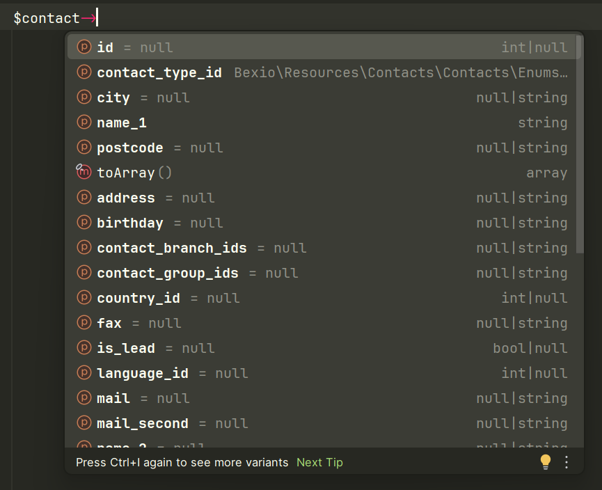

# Bexio API PHP Client

This is a ```saloonphp/saloon``` API Client for the Bexio API (https://docs.bexio.com).

It provides an API Client and API Resources DTOs with types.

## Installation

```composer require gigerit/bexio-api-client```

## Usage Examples

### Contacts

```php
$client = new BexioClient('api_token');

//Get the Contact with id 1
$request = new GetContactRequest(1);
$response = $client->send($request);

//Generate a Contact object from the response
$contact = $request->createDtoFromResponse($response);

//Use the Contact object
echo $contact->id;
echo $contact->name_1;
echo $contact->name_2;
echo $contact->mail;


//Change the Contact
$contact->name_1 = 'New Name';

//Send the updated Contact back to the API
$request = new UpdateContactRequest($contact);
$response = $client->send($request);
```

## DTOs

Our DTOs provide you with type hinting and autocompletion in your IDE.


