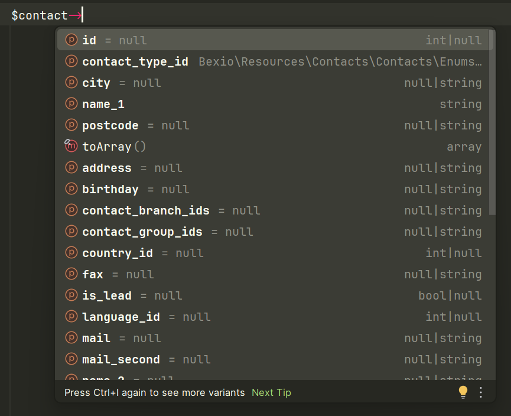

# Bexio API Laravel Package

A Laravel package for the [Bexio API](https://docs.bexio.com), built with [`saloonphp/saloon`](https://docs.saloon.dev/) as API connector and [`spatie/laravel-data`](https://github.com/spatie/laravel-data) for DTOs.

## Requirements

- PHP 8.2+
- Laravel 10.x, 11.x, 12.x, or 13.x

## Installation

```sh
composer require gigerit/bexio-api-client
```

The package will automatically register its service provider.

### Publish Configuration

```sh
php artisan vendor:publish --tag=bexio-config
```

This will create a `config/bexio.php` configuration file.

### Environment Variables

Add your Bexio API credentials to your `.env` file:

```env
# For Personal Access Token (simplest method)
BEXIO_ACCESS_TOKEN=your-access-token

# For OAuth2 (user-based authentication)
BEXIO_CLIENT_ID=your-client-id
BEXIO_CLIENT_SECRET=your-client-secret
BEXIO_REDIRECT_URI=https://your-app.com/bexio/callback

# Optional: persisted OAuth tokens
BEXIO_OAUTH_ACCESS_TOKEN=your-oauth-access-token
BEXIO_OAUTH_REFRESH_TOKEN=your-oauth-refresh-token
```

## Quick Start

### Using Dependency Injection

```php
use Bexio\BexioClient;
use Bexio\Resources\Contacts\Contacts\Contact;

class ContactController extends Controller
{
    public function index(BexioClient $client)
    {
        $contacts = Contact::useClient($client)->all();

        return view('contacts.index', compact('contacts'));
    }

    public function show(BexioClient $client, int $id)
    {
        $contact = Contact::useClient($client)->find($id);

        return view('contacts.show', compact('contact'));
    }
}
```

### Using the Facade

```php
use Bexio\Facades\Bexio;
use Bexio\Resources\Contacts\Contacts\Contact;

// Get all contacts
$contacts = Contact::useClient(Bexio::getFacadeRoot())->all();

// Or resolve the client directly
$client = app('bexio');
$contacts = Contact::useClient($client)->all();
```

### Resource Guides

Detailed resource usage is documented in segmented guides under `docs/resources/` so this README stays high-level.

- [Resource guides index](docs/resources/README.md)
- [Contacts guides](docs/resources/contacts/README.md)
- [Contacts resource](docs/resources/contacts/contacts.md)
- [Orders resource](docs/resources/sales/orders.md)

## OAuth2 Authentication

For user-based authentication where users authenticate with their own Bexio account:

### 1. Generate Authorization URL

```php
use Bexio\BexioAuth;
use Illuminate\Support\Str;

class BexioAuthController extends Controller
{
    public function redirect()
    {
        $auth = new BexioAuth(
            config('bexio.oauth.client_id'),
            config('bexio.oauth.client_secret'),
            config('bexio.oauth.redirect_uri')
        );

        $state = Str::random(40);

        session()->put('bexio_state', $state);

        $url = $auth->getAuthorizationUrl(
            scopes: config('bexio.scopes'),
            state: $state
        );

        return redirect($url);
    }
}
```

### 2. Handle Callback

```php
use Bexio\BexioAuth;

public function callback(Request $request)
{
    $code = $request->get('code');
    $state = $request->get('state');

    if ($state !== session('bexio_state')) {
        abort(403, 'Invalid state');
    }

    $auth = new BexioAuth(
        config('bexio.oauth.client_id'),
        config('bexio.oauth.client_secret'),
        config('bexio.oauth.redirect_uri')
    );

    $authenticator = $auth->getAccessToken($code, $state, session('bexio_state'));

    // Store the tokens (serialize the $authenticator or store individual values)
    auth()->user()->update([
        'bexio_access_token' => $authenticator->getAccessToken(),
        'bexio_refresh_token' => $authenticator->getRefreshToken(),
        'bexio_expires_at' => $authenticator->getExpiresAt(),
    ]);

    return redirect()->route('dashboard');
}
```

### 3. Use with Per-User Authentication

```php
use Bexio\BexioAuth;
use DateTimeImmutable;
use Bexio\Resources\Contacts\Contacts\Contact;
use Bexio\BexioClient;
use Saloon\Http\Auth\AccessTokenAuthenticator;

public function getContacts()
{
    $user = auth()->user();

    $authService = new BexioAuth(
        config('bexio.oauth.client_id'),
        config('bexio.oauth.client_secret'),
        config('bexio.oauth.redirect_uri')
    );

    $auth = new AccessTokenAuthenticator(
        $user->bexio_access_token,
        $user->bexio_refresh_token,
        new DateTimeImmutable($user->bexio_expires_at)
    );

    if ($auth->hasExpired()) {
        $auth = $authService->refreshAccessToken($auth);

        $user->update([
            'bexio_access_token' => $auth->getAccessToken(),
            'bexio_refresh_token' => $auth->getRefreshToken(),
            'bexio_expires_at' => $auth->getExpiresAt(),
        ]);
    }

    $client = new BexioClient($auth->getAccessToken());

    return Contact::useClient($client)->all();
}
```

## Documentation

For detailed documentation and advanced usage examples, see:

### Resource Guides

- **[Resource Guides Index](docs/resources/README.md)** - Entry point for segmented per-resource documentation
- **[Contacts Guides](docs/resources/contacts/README.md)** - Contacts, Contact Relations, Contact Groups, Contact Sectors, Additional Addresses, Salutations, and Titles
- **[Orders Guide](docs/resources/sales/orders.md)** - Order CRUD, search endpoint usage, and status helpers
- **[Legacy Contacts Redirect](docs/CONTACTS.md)** - Compatibility landing page pointing to the segmented contacts guides

### Additional Resources

- [Tests](tests/Resources) - Unit tests with practical examples

## Data Transfer Objects

DTOs provide type hinting and autocompletion in the IDE, for a better development experience.


## Available Resources

### CONTACTS

| Resource             | Implemented |
| -------------------- | ----------- |
| Contacts             | ✅          |
| Contact Relations    | ✅          |
| Contact Groups       | ✅          |
| Contact Sectors      | ✅          |
| Additional Addresses | ✅          |
| Salutations          | ✅          |
| Titles               | ✅          |

### SALES ORDER MANAGEMENT

| Resource            | Implemented |
| ------------------- | ----------- |
| Quotes              | ✅          |
| Orders              | ✅          |
| Deliveries          | ✅          |
| Invoices            | ✅          |
| Document Settings   | ✅          |
| Comments            | ✅          |
| Default positions   | ✅          |
| Item positions      | ✅          |
| Text positions      | ✅          |
| Subtotal positions  | ✅          |
| Discount positions  | ✅          |
| Pagebreak positions | ✅          |
| Sub positions       | ✅          |
| Document templates  | ✅          |

### PURCHASE

| Resource         | Implemented |
| ---------------- | ----------- |
| Bills            | ✅          |
| Expenses         | ✅          |
| Purchase Orders  | ✅          |
| Outgoing Payment | ✅          |

### ACCOUNTING

| Resource       | Implemented |
| -------------- | ----------- |
| Accounts       | ✅          |
| Account Groups | ✅          |
| Calendar Years | ✅          |
| Business Years | ✅          |
| Currencies     | ✅          |
| Manual Entries | ✅          |
| Reports        | ✅          |
| Taxes          | ✅          |
| Vat Periods    | ✅          |

### BANKING

| Resource      | Implemented |
| ------------- | ----------- |
| Bank Accounts | ✅          |
| IBAN Payments | ✅          |
| QR Payments   | ✅          |
| Payments      | ✅          |

### ITEMS & PRODUCTS

| Resource        | Implemented |
| --------------- | ----------- |
| Items           | ✅          |
| Stock locations | ✅          |
| Stock Areas     | ✅          |

### PROJECTS & TIME TRACKING

| Resource            | Implemented |
| ------------------- | ----------- |
| Projects            | ✅          |
| Timesheets          | ✅          |
| Business Activities | ✅          |
| Communication Types | ✅          |

### FILES

| Resource | Implemented |
| -------- | ----------- |
| Files    | ✅          |

### OTHER

| Resource        | Implemented |
| --------------- | ----------- |
| Company Profile | ✅          |
| Countries       | ✅          |
| Languages       | ✅          |
| Notes           | ✅          |
| Payment Types   | ✅          |
| Permissions     | ✅          |
| Tasks           | ✅          |
| Units           | ✅          |
| User Management | ✅          |

## Testing

```sh
composer test
```

## License

MIT License - see the [LICENSE](LICENSE) file for details.
