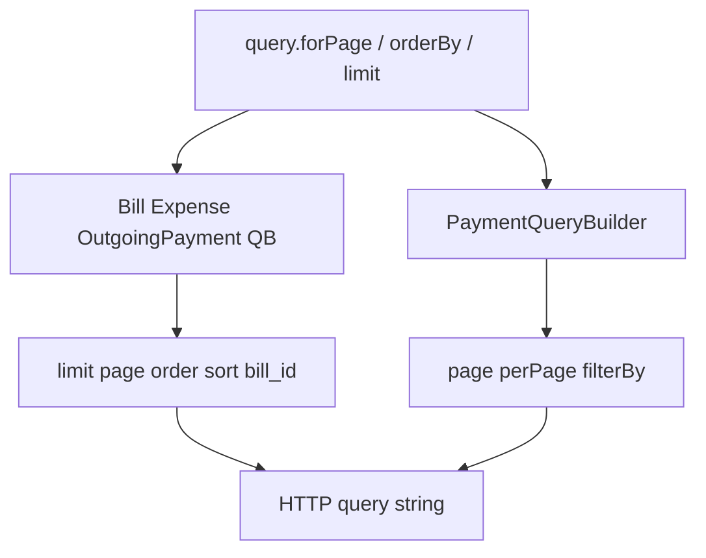

# Fix v4 page-based QueryBuilder pagination

> **For agentic workers:** REQUIRED SUB-SKILL: Use superpowers:subagent-driven-development (recommended) or superpowers:executing-plans to implement this plan task-by-task. Steps use checkbox (`- [ ]`) syntax for tracking.

**Goal:** Make Bills, OutgoingPayments, Expenses, and Payments QueryBuilders emit correct Bexio v4 pagination/sort query keys instead of leaking base `offset`/`order_by`.

**Architecture:** Shared purchase trait maps `forPage`/`orderBy` to `page`/`limit`/`order`/`sort` (1-based). PaymentQueryBuilder stays on 0-based `page`/`per-page` and hardens inherited `limit`/`offset`/`orderBy`. Expenses request switches `offset` → `page`.

**Tech Stack:** PHP 8.2+, Saloon requests, Pest + MockClient

## Global Constraints

- Do not remap Bills/OutgoingPayments/Expenses/Payments to v2 `offset`/`order_by`.
- Do not hard-require OutgoingPayments `bill_id` on every list (live `all()` works without it).
- Prefer MockClient query assertions; thin live smokes only.
- Keep File / PurchaseOrder / Account / Tax pagination behavior unchanged.
- Update `AGENTS.md` with the v4 page-builder caveat.

---

## Problem

Base `QueryBuilder` speaks v2 `limit`/`offset`/`order_by`. Unmatched-query forwarding made v4 page APIs send **wrong keys** instead of silently dropping them.

| Resource | Docs expect | Current actual |
|----------|-------------|----------------|
| Bills `GET /4.0/purchase/bills` | `limit`, `page`, `order`, `sort` | `limit`, `offset`, `order_by` |
| OutgoingPayments `GET /4.0/purchase/outgoing-payments` | `bill_id`, `limit`, `page`, `order`, `sort` | wrong keys; no `bill_id` helper |
| Expenses `GET /4.0/expenses` | `limit`, `page`, `order`, `sort` | ctor/`defaultQuery` emit `offset` |
| Payments `GET /4.0/banking/payments` | `page`, `per-page`, `filter-by` | `forPage` OK; inherited `limit`/`offset`/`orderBy` leak |

## Locked approach

### Shared purchase concern

Add [`src/Resources/Purchase/Concerns/BuildsPageBasedListQueries.php`](src/Resources/Purchase/Concerns/BuildsPageBasedListQueries.php) (mirror sales concerns):

- `forPage($page, $perPage)` → set `page` (1-based) + `limit` (never `offset`)
- `orderBy($field, $direction)` → set `sort` + `order` (never `order_by`)
- `offset()` → throw `InvalidArgumentException` (use `page()` / `forPage()`)
- `page(int $page): static`
- Keep public `limit()` as page size
- `indexRequestArguments()` returns only allowed keys (`limit`, `page`, `order`, `sort`) plus `additionalIndexQueryParameters()` hook
- Filter nulls with `!== null` (do not drop intentional empty strings)

### Concrete builders

1. `BillQueryBuilder` — trait; wire `Bill::QUERY_BUILDER` + `@method`
2. `ExpenseQueryBuilder` — trait; wire `Expense::QUERY_BUILDER`
3. `OutgoingPaymentQueryBuilder` — trait + `forBill(string $billId)` via additional params; wire `OutgoingPayment::QUERY_BUILDER`. Do **not** hard-require `bill_id` on every list.

### Request fixes

- `GetExpensesRequest`: replace `$offset` with `$page` (default `1`); emit `page` in `defaultQuery`. Update `EndpointCompletionRequestsTest`.
- `GetBillsRequest`: remove empty no-op `__construct()`.
- OutgoingPayments request: keep zero-ctor; builder supplies `bill_id` when set.

### Payments harden

In `PaymentQueryBuilder`:

- `limit($n)` remaps to `perPage($n)`
- `offset()` throws
- `orderBy()` throws
- `indexRequestArguments()` whitelist only `filterBy` / `page` / `perPage`



## Out of scope

- Full Bill/Expense filter fluent surface beyond pagination/sort/`forBill`
- DocumentSettings / Employees / CompanyProfiles unsupported-param leakage
- InvoiceReminder pagination (docs have none)

---

### Task 1: Failing purchase pagination tests + shared trait scaffolding

**Files:**
- Create: `tests/Unit/Resources/Purchase/PageBasedListQueryBuilderTest.php` (or add beside existing purchase tests)
- Create: `src/Resources/Purchase/Concerns/BuildsPageBasedListQueries.php`

- [ ] Write MockClient tests expecting Bill/Expense/OutgoingPayment `forPage(2,15)->orderBy('document_no','desc')` → `limit=15&page=2&sort=document_no&order=desc` and **no** `offset`/`order_by`
- [ ] Assert `offset()` throws on those builders
- [ ] Assert OutgoingPayment `forBill('uuid')` adds `bill_id`
- [ ] Run tests — confirm fail before builders exist
- [ ] Implement `BuildsPageBasedListQueries` trait

### Task 2: Wire purchase builders

**Files:**
- Create: `src/Resources/Purchase/Bills/BillQueryBuilder.php`
- Create: `src/Resources/Purchase/Expenses/ExpenseQueryBuilder.php`
- Create: `src/Resources/Purchase/OutgoingPayments/OutgoingPaymentQueryBuilder.php`
- Modify: `Bill.php`, `Expense.php`, `OutgoingPayment.php`

- [ ] Implement three builders using the trait
- [ ] Wire `QUERY_BUILDER` + `@method` on resources
- [ ] Remove empty `GetBillsRequest::__construct()`
- [ ] Re-run purchase pagination tests — pass

### Task 3: Expenses request `offset` → `page`

**Files:**
- Modify: `src/Resources/Purchase/Expenses/Requests/GetExpensesRequest.php`
- Modify: `tests/Resources/Purchase/EndpointCompletionRequestsTest.php`
- Modify: live/mock expense tests as needed

- [ ] Replace ctor `$offset` with `$page` (default 1); validate `page >= 1`
- [ ] Emit `page` in `defaultQuery`
- [ ] Update EndpointCompletion assertions from `offset: 10` to `page: 2` (or equivalent)
- [ ] Add/adjust MockClient expense `forPage` assertion
- [ ] Thin live: `Expense::query()->limit(1)->get()` count ≤ 1

### Task 4: Harden PaymentQueryBuilder

**Files:**
- Modify: `src/Resources/Banking/Payments/PaymentQueryBuilder.php`
- Modify: `tests/Resources/Banking/PaymentRequestsTest.php` (or unit mock sibling)

- [ ] Remap `limit()` → `perPage()`
- [ ] Throw on `offset()` / `orderBy()`
- [ ] Whitelist `indexRequestArguments()` to `filterBy`/`page`/`perPage`
- [ ] MockClient: `limit(10)` → `per-page=10`, no stray `limit` key
- [ ] MockClient: `offset`/`orderBy` throw
- [ ] Existing `perPage(1)` live tests stay green

### Task 5: AGENTS.md + validation

**Files:**
- Modify: `AGENTS.md`

- [ ] Document v4 purchase list builders (`page`/`order`/`sort`) and banking payments (`page`/`perPage`); note `offset`/`order_by` must not be assumed
- [ ] Run focused pest: purchase page tests, EndpointCompletion, Payment, Account/Tax regression smoke
- [ ] Confirm File/PurchaseOrder pagination unaffected

## Validation

```bash
# via lerd vendor_run pest:
tests/Unit/Resources/Purchase/PageBasedListQueryBuilderTest.php
tests/Resources/Purchase/EndpointCompletionRequestsTest.php
tests/Resources/Purchase/Bills/BillRequestsTest.php
tests/Resources/Purchase/Expenses/ExpenseRequestsTest.php
tests/Resources/Purchase/OutgoingPayments/OutgoingPaymentRequestsTest.php
tests/Resources/Banking/PaymentRequestsTest.php
tests/Unit/QueryBuilderTest.php
tests/Resources/Accounting/Accounts/AccountRequestsTest.php
tests/Resources/Accounting/Taxes/TaxRequestsTest.php
```
